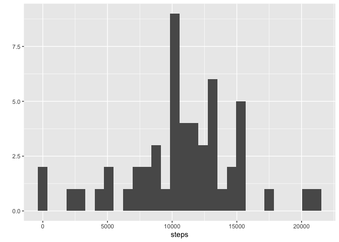
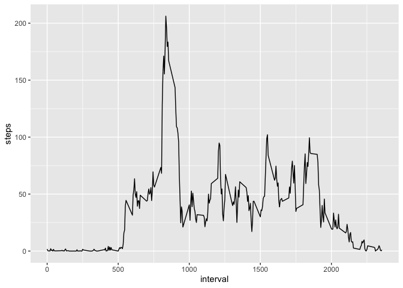
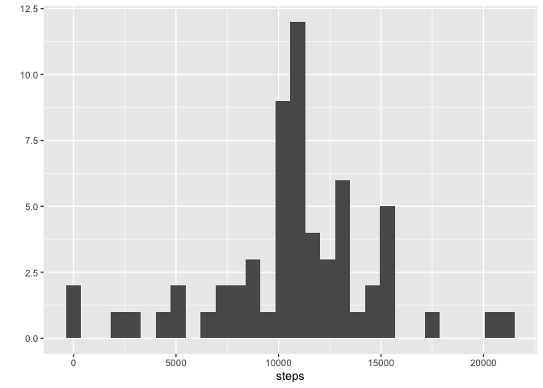
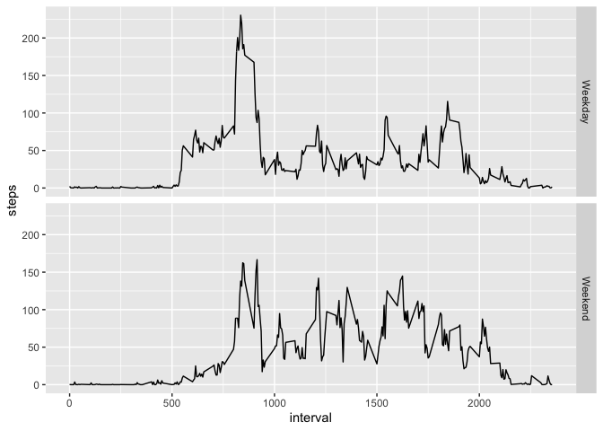

## Loading and preprocessing the data

```r
library(dplyr)
```

```
## 
## Attaching package: 'dplyr'
```

```
## The following objects are masked from 'package:stats':
## 
##     filter, lag
```

```
## The following objects are masked from 'package:base':
## 
##     intersect, setdiff, setequal, union
```

```r
library(ggplot2)
unzip("activity.zip",exdir = "data")

activity <- read.csv("data/activity.csv")

str(activity)
```

```
## 'data.frame':	17568 obs. of  3 variables:
##  $ steps   : int  NA NA NA NA NA NA NA NA NA NA ...
##  $ date    : chr  "2012-10-01" "2012-10-01" "2012-10-01" "2012-10-01" ...
##  $ interval: int  0 5 10 15 20 25 30 35 40 45 ...
```

```r
head(activity)
```

```
##   steps       date interval
## 1    NA 2012-10-01        0
## 2    NA 2012-10-01        5
## 3    NA 2012-10-01       10
## 4    NA 2012-10-01       15
## 5    NA 2012-10-01       20
## 6    NA 2012-10-01       25
```


```r
# remove missing values
act <- na.omit(activity)
```


## What is mean total number of steps taken per day?


```r
# 1. Calculate the total number of steps taken per day
act_day <- act %>% 
  group_by(date)%>%
  summarise(steps = sum(steps))
```

```
## `summarise()` ungrouping output (override with `.groups` argument)
```

```r
act_day
```

```
## # A tibble: 53 x 2
##    date       steps
##    <chr>      <int>
##  1 2012-10-02   126
##  2 2012-10-03 11352
##  3 2012-10-04 12116
##  4 2012-10-05 13294
##  5 2012-10-06 15420
##  6 2012-10-07 11015
##  7 2012-10-09 12811
##  8 2012-10-10  9900
##  9 2012-10-11 10304
## 10 2012-10-12 17382
## # … with 43 more rows
```


```r
# 2. Make a histogram of the total number of steps taken each day
qplot(steps, data=act_day)
```

```
## `stat_bin()` using `bins = 30`. Pick better value with `binwidth`.
```

<!-- -->


```r
# 3. Calculate and report the mean and median of the total number of steps taken per day
mean(act_day$steps)
```

```
## [1] 10766.19
```

```r
median(act_day$steps)
```

```
## [1] 10765
```


## What is the average daily activity pattern?


```r
# 1. Make a time series plot (i.e. \color{red}{\verb|type = "l"|}type = "l") of the 5-minute interval (x-axis) and the average number of steps taken, averaged across all days (y-axis)

act_int <- act %>%
  group_by(interval)%>%
  summarize(steps=mean(steps))
```

```
## `summarise()` ungrouping output (override with `.groups` argument)
```

```r
act_int
```

```
## # A tibble: 288 x 2
##    interval  steps
##       <int>  <dbl>
##  1        0 1.72  
##  2        5 0.340 
##  3       10 0.132 
##  4       15 0.151 
##  5       20 0.0755
##  6       25 2.09  
##  7       30 0.528 
##  8       35 0.868 
##  9       40 0     
## 10       45 1.47  
## # … with 278 more rows
```

```r
ggplot(act_int, aes(interval, steps)) + geom_line()
```

<!-- -->


```r
# 2. Which 5-minute interval, on average across all the days in the dataset, contains the maximum number of steps?

act_int[act_int$steps==max(act_int$steps),]
```

```
## # A tibble: 1 x 2
##   interval steps
##      <int> <dbl>
## 1      835  206.
```


## Imputing missing values


```r
# 1. Calculate and report the total number of missing values in the dataset (i.e. the total number of rows with \color{red}{\verb|NA|}NAs)

nrow(activity)-nrow(act)
```

```
## [1] 2304
```


```r
# 2. Devise a strategy for filling in all of the missing values in the dataset. The strategy does not need to be sophisticated. For example, you could use the mean/median for that day, or the mean for that 5-minute interval, etc.

# Filling in missing values with median of dataset. 
names(act_int)[2] <- "mean.steps"
act_impute <- merge(activity, act_int)
```


```r
# 3. Create a new dataset that is equal to the original dataset but with the missing data filled in.

act_impute$steps[is.na(act_impute$steps)] <- act_impute$mean.steps[is.na(act_impute$steps)]
```


```r
# 4. Make a histogram of the total number of steps taken each day and Calculate and report the mean and median total number of steps taken per day. Do these values differ from the estimates from the first part of the assignment? What is the impact of imputing missing data on the estimates of the total daily number of steps?
act_day_imp <- act_impute%>%
  group_by(date)%>%
  summarize(steps=sum(steps))
```

```
## `summarise()` ungrouping output (override with `.groups` argument)
```

```r
act_day_imp
```

```
## # A tibble: 61 x 2
##    date        steps
##    <chr>       <dbl>
##  1 2012-10-01 10766.
##  2 2012-10-02   126 
##  3 2012-10-03 11352 
##  4 2012-10-04 12116 
##  5 2012-10-05 13294 
##  6 2012-10-06 15420 
##  7 2012-10-07 11015 
##  8 2012-10-08 10766.
##  9 2012-10-09 12811 
## 10 2012-10-10  9900 
## # … with 51 more rows
```

```r
qplot(steps, data=act_day_imp)
```

```
## `stat_bin()` using `bins = 30`. Pick better value with `binwidth`.
```

<!-- -->

```r
mean(act_day_imp$steps)
```

```
## [1] 10766.19
```

```r
median(act_day_imp$steps)
```

```
## [1] 10766.19
```


## Are there differences in activity patterns between weekdays and weekends?


```r
# 1. Create a new factor variable in the dataset with two levels – “weekday” and “weekend” indicating whether a given date is a weekday or weekend day.

act_impute$dayofweek <- weekdays(as.Date(act_impute$date))
act_impute$weekend <-as.factor(act_impute$dayofweek=="Saturday"|act_impute$dayofweek=="Sunday")
levels(act_impute$weekend) <- c("Weekday", "Weekend")
```


```r
# 2. Make a panel plot containing a time series plot (i.e. \color{red}{\verb|type = "l"|}type = "l") of the 5-minute interval (x-axis) and the average number of steps taken, averaged across all weekday days or weekend days (y-axis). See the README file in the GitHub repository to see an example of what this plot should look like using simulated data.

act_weekday <- act_impute[act_impute$weekend=="Weekday",]
act_weekend <- act_impute[act_impute$weekend=="Weekend",]
```


```r
act_int_weekday <- act_weekday%>%
  group_by(interval)%>%
  summarize(steps=mean(steps))
```

```
## `summarise()` ungrouping output (override with `.groups` argument)
```

```r
act_int_weekday$weekend <- "Weekday"


act_int_weekend <- act_weekend%>%
  group_by(interval)%>%
  summarize(steps=mean(steps))
```

```
## `summarise()` ungrouping output (override with `.groups` argument)
```

```r
act_int_weekend$weekend <- "Weekend"


act_int <- rbind(act_int_weekday, act_int_weekend)
act_int$weekend <- as.factor(act_int$weekend)
ggplot(act_int, aes(interval, steps)) + geom_line() + facet_grid(weekend ~ .)
```

<!-- -->


